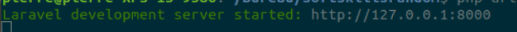

# Laravel

1. Choose your directory
   
```terminal
cd ~ 
cd Desktop
```

2. Create a new laravel project using Composer

```terminal
composer create-project --prefer-dist laravel/laravel my-app
```

3. Launch your new project

```terminal
cd my-app
php artisan serve
```

Now your app is launched on the port 8000



## Your first app

Now it is time to add some content to your new app 

- [Before](../01.Introduction/b.composer.md)
