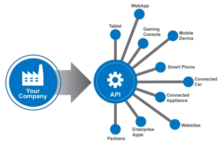

# Your first API

Before starting this section, here is a simple def of what is an API.

>A API is a set of functions and procedures allowing the creation of applications that access the features or data of an operating system, application, or other service.




## Install Postman

> Postman is currently one of the most popular tools used in API testing. It started in 2012 as a side project by Abhinav Asthana to simplify API workflow in testing and development. API stands for Application Programming Interface which allows software applications to communicate with each other via API calls.

## Initiate the project

``` terminal
cd ~ 
cd Desktop
composer create-project --prefer-dist laravel/laravel API
```

### 1. Create a new database

```terminal
mysql -u username -p
create database tasks;
```

### 2. Model, Controller and Routes/API.php

```
php artisan make:model Task -mc
```


