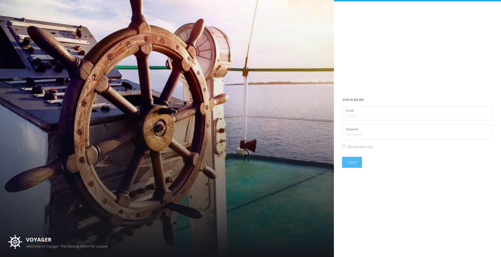
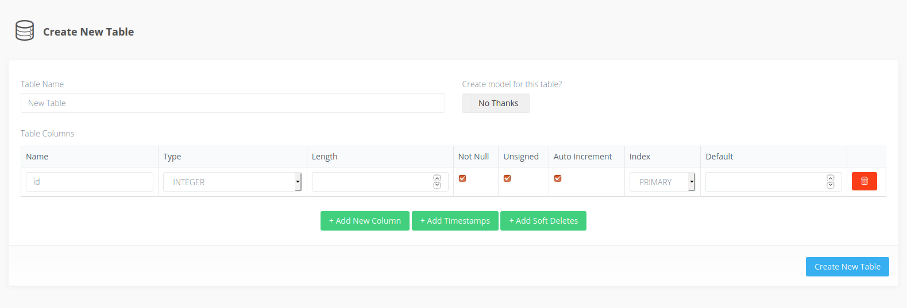
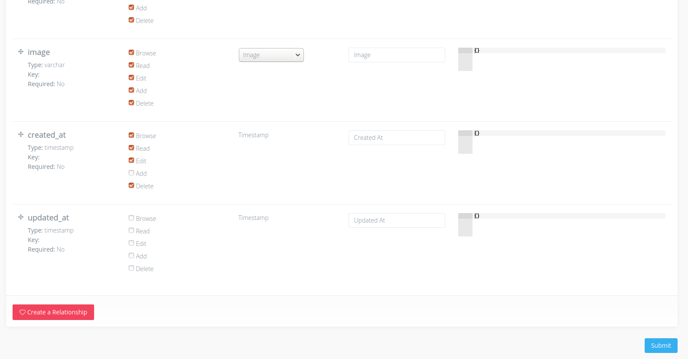

# Voyager


In this section, we are going to learn how to user **Voyager**, but before doing this, let us see what **Voyager** is.

## About Voyager

- An admin interface for your Laravel app
- An easy way to add/edit/delete data for your app
- A menu builder (build menus in Voyager for your app)
- A media manager for your files
- CRUD/BREAD generator

Voyager is simply an admin for your Laravel app. Whatever you want. ([source](https://voyager-docs.devdojo.com/getting-started/what-is-voyager))

## How to install it?

``` terminal
composer require tcg/voyager
php artisan voyager:install
php artisan serve
```

**Tips:** Don't forget to add a database to your project!

Now you can launch your app : `http://127.0.0.1:8000/admin`



## Configuration

### Create an admin account

You have to create a new admin user in order to connect to your new dashboard page.

`php artisan voyager:admin yourmail@mail.com --create`

### Images not showing? 

Replace this line `APP_URL=http://localhost` in your `.env` with this line `APP_URL=http://localhost:8000` 

## Making a blog

1. Create a model & a controller `Article` with artisan
2. Create a new table **articles** in `Tools\Database`
   1. Add three fields (title,content,image)
   2. Don't forget to add the timestamps fields



3. Edit the rows for the articles table, change the input type for the image field



4. Add a new article in the **articles** section (Appears in the right)

5. Now, you have to display all the articles with the route `/articles`. And guess what? You already know how to do that.

**TIPS** => display images in your view `{{ Voyager::image($article->image) }}`

